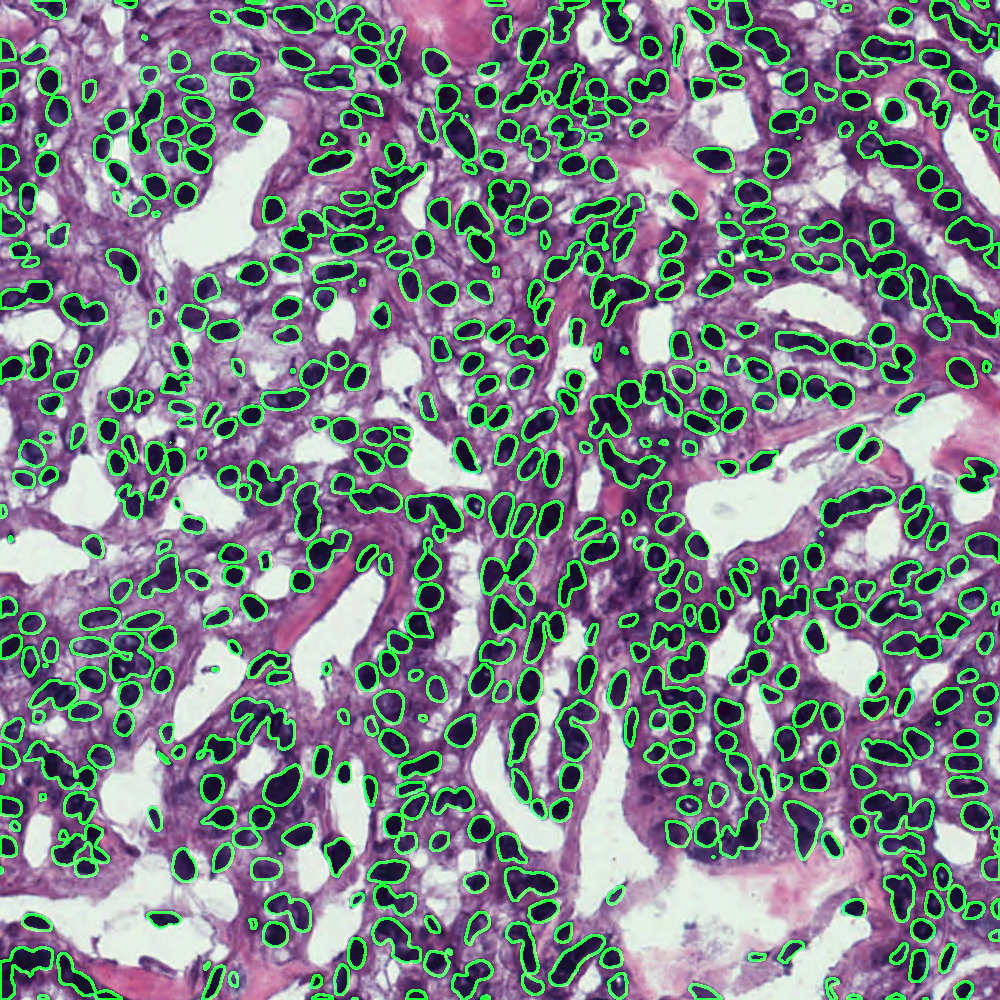

# High quality figures used in the dicta 2023 conference paper _Semantic Segmentation for Improved Cell Nuclei Analysis_

## Figure 1:

  
  
  ***Fig. 1.** A Hematoxylin and Eosin stained tissue image*
  

## Figure 2:

  
  **(a)** |  **(b)**
:-------------------------:|:-------------------------:
  |  
 **(c)** |  **(d)**
   |  

***Fig. 2.** Images from the MoNuSeg dataset. (a) and (c) show original images from the MoNuSeg dataset. (b) shows an example of a well-stained slide with minimal change. (d) shows an example of a poorly stained slide with moderate colour change*

## Figure 3:

 
  **(a)** |  **(b)**
:-------------------------:|:-------------------------:
  |  
 **(c)** |  **(d)**
   |  

***Fig. 3.** Images from the MoNuSeg dataset. (a) and (c) show just stain normalised images. (b) shows the image after applying CLAHE. (d) shows the image after applying CLAHE*

## Figure 4:

 
  **(a)** |  **(b)**
:-------------------------:|:-------------------------:
  |  
 **(c)** |  **(d)**
   |  

***Fig. 4.** All model predictions from the original MoNuSeg test set. (a) Ground truth provided for reference with three model predictions, (b) DeepLabV3+, (c) U-Net, (d) YOLOv8*

## Figure 5:

 
  **(a)** |  **(b)**
:-------------------------:|:-------------------------:
  |  
 **(c)** |  **(d)**
   |  

***Fig. 5.** All model predictions from the stain normalised MoNuSeg test set. (a) Ground truth provided for reference with three model predictions, (b) DeepLabV3+, (c) U-Net, (d) YOLOv8*

